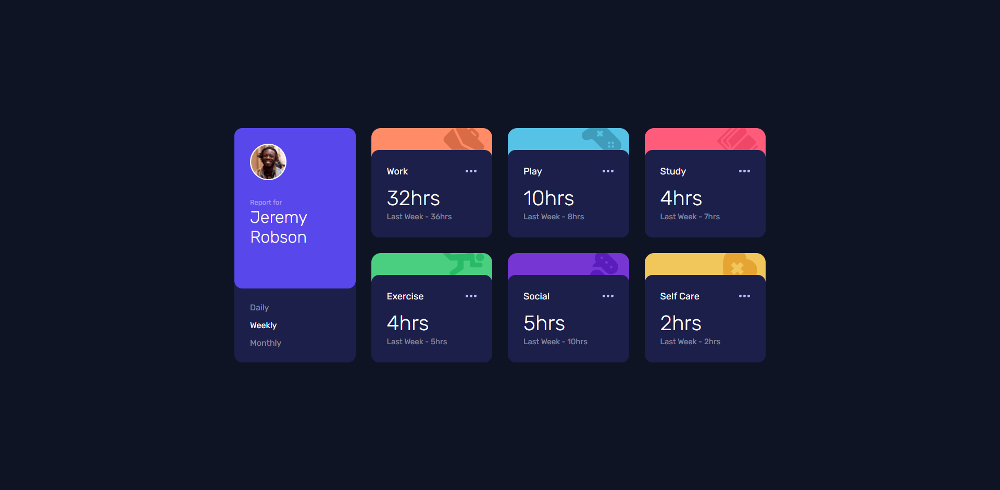
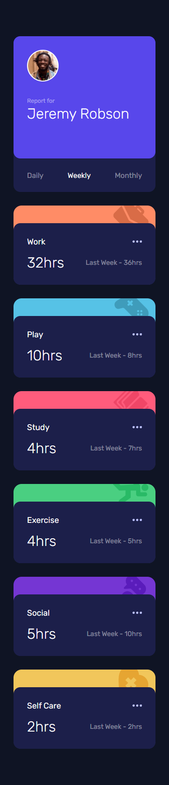

# Frontend Mentor - Time tracking dashboard solution

This is a solution to the [Time tracking dashboard challenge on Frontend Mentor](https://www.frontendmentor.io/challenges/time-tracking-dashboard-UIQ7167Jw). Frontend Mentor challenges help you improve your coding skills by building realistic projects.

## Table of contents

- [Overview](#overview)
  - [The challenge](#the-challenge)
  - [Screenshot](#screenshot)
  - [Links](#links)
- [My process](#my-process)
  - [Built with](#built-with)
  - [What I learned](#what-i-learned)
  - [Continued development](#continued-development)
- [Author](#author)

## Overview

### The challenge

Users should be able to:

- View the optimal layout for the site depending on their device's screen size
- See hover states for all interactive elements on the page
- Switch between viewing Daily, Weekly, and Monthly stats

### Screenshot

### Links

- Solution URL: [View Code on GitHub](https://github.com/ANSH4195/fm-time-dashboard)
- Live Site URL: [Deployed on Vercel](https://fm-time-dashboard.vercel.app/)

## My process

### Built with

- Semantic HTML5 markup
- CSS custom properties
- Flexbox
- CSS Grid
- [React](https://reactjs.org/) - JS library
- [SASS](https://sass-lang.com/documentation) - For styles

### What I learned

I used custom SASS for the first time and loved it. Utilizing mixins, loops and variables, the css code cut down considerably.

### Continued development

I would want to go ahead and create many more projects and practice writing reusable styles and splitting code.

## Author

- Website - [Ansh Shrivastava](https://www.github.com/ANSH4195/)
- Twitter - [@AnshShr1vastava](https://www.twitter.com/AnshShr1vastava)
- Frontend Mentor - [@ANSH4195](https://www.frontendmentor.io/profile/ANSH4195)
